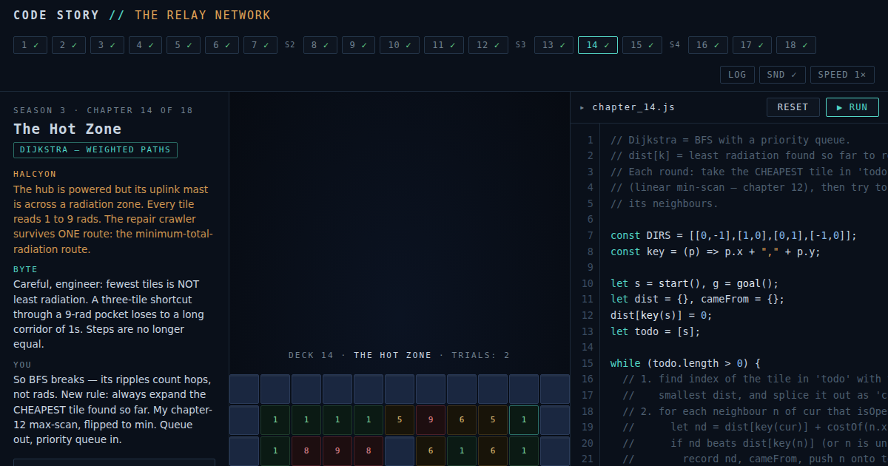

# Code Story

A story-driven browser game that teaches **algorithms, data structures, and
core CS techniques** by making you program a robot to save a crippled
starship. Built for adult career-switchers: real JavaScript from chapter one,
no drag-and-drop blocks. Five seasons, twenty-three chapters.

**Play it:** [raja-donthireddy.github.io/Code-Story](https://raja-donthireddy.github.io/Code-Story/) —
or just open `index.html` in any browser. No build step, no dependencies,
no network — the whole game is one self-contained file.

## Premise

The deep-space freighter *Meridian* hit a debris storm. The ship's AI is
fragmented, the crew is in cryo, and you — the newest engineer aboard, first
job after switching careers — are awake. Your one tool is **Byte**, a
maintenance robot that executes any JavaScript you upload.

## The curriculum

Each chapter is a mission that quietly *is* a classic algorithm. Later
chapters run your program against **randomized trials**, so memorized command
lists fail and only general algorithms pass — the core lesson of the game.

**Season 1 — Signal Lost** (algorithms):

| Ch | Mission | Concept | The teeth |
|----|-------------------|--------------------------|-----------|
| 1 | Wake-Up Call | Sequences | Byte does exactly what you wrote — nothing else |
| 2 | The Long Walk | Loops | 10-line uplink buffer: copy-paste won't fit |
| 3 | The Shifting Deck | Conditionals | 3 randomized corridors, one program |
| 4 | The Dead Cell | Linear search — O(n) | The dead cell moves every trial |
| 5 | The Archive | Binary search — O(log n) | 15 cabinets, only 4 scanner charges |
| 6 | Cargo Shuffle | Sorting — O(n²) | Order is verified when your program ends |
| 7 | Escape Route | Pathfinding | Unmapped maze, local sensors only |

**Season 2 — Cold Storage** (data structures — wake the frozen crew):

| Ch | Mission | Concept | The teeth |
|----|--------------------|--------------------------|-----------|
| 8 | Pressure Seals | Stacks — LIFO | One-way weld log; seals come off newest-first |
| 9 | Wake Order | Queues — FIFO | 3-slot comm relay overflows unless you buffer |
| 10 | The Conveyor Chain | Linked lists | No master list — the chain IS the data; splice around corrosion |
| 11 | The Manifest | Hash maps — O(1) | 8 lookups, 24 records, 30-read budget: build an index |
| 12 | The Critical List | Priority queues | Most-critical pod always wakes first, alerts keep arriving |

**Season 3 — The Relay Network** (graphs — restore the sector):

| Ch | Mission | Concept | The teeth |
|----|------------------|--------------------------|-----------|
| 13 | The Debris Field | Breadth-first search | Fuel for exactly the shortest route — chapter 7's wall-follower won't cut it |
| 14 | The Hot Zone | Dijkstra — weighted paths | Fewest tiles ≠ least radiation; grids are built so plain BFS always fails |
| 15 | Restart Sequence | Topological sort | Dependency-locked systems; list order is never a valid restart order |

**Season 4 — First Contact** (techniques — answer the signal):

| Ch | Mission | Concept | The teeth |
|----|-------------|-----------------------------|-----------|
| 16 | The Ice Moon | Recursion — divide & conquer | 64 cells, 14 rectangle probes, one dig: quarter or die |
| 17 | The Toll Road | Dynamic programming | Greedy provably overpays; brute-force recursion trips the guard |
| 18 | The Message | Parsing — recursive descent | Nested repeat-blocks; flat find-and-replace shatters on trial 2 |

**Season 5 — The Deep Archive** (interview-staple techniques — a gift, not a threat):

| Ch | Mission | Concept | The teeth |
|----|--------------------|--------------------------|-----------|
| 19 | The Index Tree | Binary search trees | 15-node tree, 3 randomized targets; wrong comparison direction walks off the tree |
| 20 | The Sift | Binary heaps | Extract-min + sift-down, checked against the exact sorted output — skip the sift and the order breaks |
| 21 | The Broadcast Window | Greedy algorithms | 7 windows; sorting by duration or start time is provably worse than by end time, every trial |
| 22 | The Shortest Span | Two pointers — sliding window | Shortest sum-threshold span; the first span that works is never the shortest one |
| 23 | The Sentry Grid | Backtracking | 5×5 N-queens, 2 damaged cells; commit, discover a dead end, undo, retry |

**Side missions** — because one rep per concept is never enough. Completing a
chapter unlocks an optional practice variant: lower-bound binary search
(ch 5), bracket matching (ch 8), frequency counting (ch 11), flood fill
(ch 13), and take-or-skip DP, a.k.a. House Robber (ch 17).

**JS Primer** — five skippable lessons (calling a function, variables,
numbers vs. text, if/else, for loops) for players with zero prior
JavaScript. Offered as a fork on first visit, or anytime via the header.

After each chapter a **concept card** names what you just did, gives the
big-O intuition, and maps it to real-world engineering (and interviews).

## Reference Library

Every chapter's mission panel now includes a **"How it actually works"** box:
a plain-language explanation, separate from the story, plus complexity
badges (O(log n), O(n²), …) and a link into the full **📚 LEARN** reference
— reachable from that link, from the header anytime, or from the intro.

The reference library has its own dedicated page per concept (23 total,
covering every chapter — algorithms, data structures, graphs, techniques,
and Season 5's trees/heaps/greedy/two-pointers/backtracking), each with:

- A plain-English explanation, independent of the story/robot framing.
- Complexity badges and runnable pseudocode.
- A **Common Mistakes** list — the specific ways people actually get each
  concept wrong (off-by-ones, unstable sorts, missing base cases, negative
  Dijkstra weights, treating a priority queue like FIFO, skipping a heap's
  sift-down, and so on).
- **At least two interactive visualizations per concept**, switchable via
  tabs — a primary "how it works" walkthrough plus a second scenario that
  puts a common mistake or edge case on screen: binary search's "not found"
  case, a maze with a sealed loop that traps the wall-follower forever, a
  negative graph edge that makes Dijkstra confidently report the wrong
  answer, selection sort silently reordering tied elements, deleting a
  linked list's head node, a heap that silently returns the wrong minimum
  after a skipped sift-down, and more. Six flagship concepts (binary
  search, sorting, BFS, Dijkstra, dynamic programming, and
  recursion/divide-and-conquer) go further with a **third example** showing
  a genuinely different angle — a rotated-array binary search, merge sort,
  multi-source BFS, a uniform-weight Dijkstra run that visibly reduces to
  BFS, House Robber as a second DP recurrence, and fast exponentiation.
  Playback has Play/Step/Reset controls, modeled on the step-through
  presentation style of sites like
  [algorithm-visualizer.org](https://algorithm-visualizer.org/branch-and-bound/binary-search).
- A "Try it yourself" link that jumps straight into that concept's chapter.

The visualizations are not scripted animations — each one runs an actual
(simplified) version of the algorithm (or a deliberately broken variant, for
the mistake examples) on fixed sample data and records a frame at every
meaningful step, the same "record what happened, replay it" pattern the
game itself uses for chapter replays. That guarantees the demo always
matches the real algorithm instead of risking hand-authored frames that
drift out of sync — including the "wrong answer" demos, whose captions
report the actual computed numbers rather than an assumed outcome.

## Other tools

- **Guided tour** — a first-visit, "show and do" walkthrough of the
  workspace (Objective panel → editor → ▶ Run → the console) that spotlights
  one real UI element at a time and requires an actual interaction with it
  (not just clicking "Next") to advance. Replay it anytime via the 🧭 TOUR
  header button.
- **Step-through replay** (STEP toggle) pauses after every command and
  highlights the exact source line that fired it — a debugger, not just an
  animation.
- **Share links** (🔗 Share) encode your current chapter and code into the
  URL, so a solution can be pasted to someone and opens exactly as written.
- Runtime errors report the offending line (`[line 7: cut(...)]`); syntax
  errors get a bracket-balance hint.
- **Resizable panels** — drag the thin dividers between the mission panel,
  code editor, and game viewport (and between the editor and console) to
  reflow the layout to taste; the Reference Library's concept list is
  resizable too. Sizes persist across sessions; double-click a divider to
  reset it, or focus one and use the arrow keys.
- **Layout:** mission briefing on the left, the code editor front and
  center, the game viewport on the right — the editor gets the flexible
  center space since that's where you spend most of your time; the board
  is usually small enough to sit comfortably in a fixed-width side panel.

## For developers

- Everything lives in `index.html`: level definitions, a tiny sandboxed
  interpreter (`new Function` + loop/recursion-guard injection so infinite
  loops and runaway recursion halt gracefully), a deterministic seeded RNG
  for fair trials, and the renderer.
- User programs run headlessly against a simulated world; the recorded action
  log — tagged with the source line that produced each action — is then
  replayed as animation (instant, or paused per-step in STEP mode). Sensors
  work because simulation is synchronous.
- The editor overlay (line numbers + syntax highlighting) is dependency-free:
  a `<pre>` rendered behind a transparent `<textarea>`, kept in scroll sync.
- The reference library's `VizPlayer` class is a tiny, reusable playback
  engine (goto/play/pause) over a plain `frames` array; two renderers
  (`renderCellsFrame` for array/row-style demos, `renderGridFrame` for
  grid/pathfinding demos) cover all 23 concepts. Each concept's frames come
  from a small generator function (`genBinarySearchFrames()`, etc.) that
  runs the real algorithm on fixed sample data and pushes a frame at each
  step — the pathfinding/BFS generators reuse the actual chapter level
  builders (`LEVELS.find(l=>l.id==='bfs').build(...)`) so the demo world is
  always a genuine, solvable instance rather than a hand-authored one.
- Debug/test hooks are exposed on `window.CS` (`load(i)`, `runCode(src)`,
  `loadSide(i)`, `loadPrimer(i)`, `openLearn(id)`, `instant`, `stepMode`).
  The Playwright test suite drives every chapter's, side mission's, and
  primer lesson's intended solution, asserts every failure gate fires
  correctly, exercises step-mode pausing and share-link round-tripping, and
  opens + scrubs every concept's visualization to confirm it renders real
  content and never gets stuck.
- Progress and per-chapter code persist in `localStorage`.

See [DESIGN.md](DESIGN.md) for the full game design document, including the
learning-design principles and the roadmap for future seasons.

## License

[MIT](LICENSE) — play it, fork it, teach with it.
